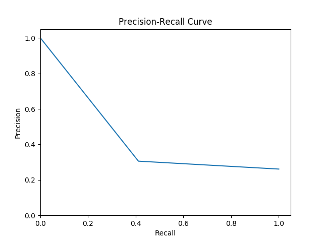

# Classification

## Overview
The files in this directory enable the training and evaluation of architectures used to classify the DDSM dataset and evaluate the INbreast dataset.

## Requirements
- `pip`

To install the necessary packages use:
```bash
pip install -r requirements_classify.txt
```

## How to use
### Training
To train the ResNet-18 architecture use the `classification_tumor.py` and `classification.py` scripts. The former will classify images as containing a mass or not and the latter will classify images as `benign`, `malignant`, or `normal`. As the first script was reported on, it is better maintained and recommended for usage.

The classification can also be run using the Jupyter notebook. To use either of the scripts above in `classification.ipynb`, make sure the proper code is imported (i.e. `classification` vs. `classification_tumor`).

To train the AlexNet architecuture, some modifications must be made to both `classification_tumor.py` and `classification.py` scripts. First, for the data loaders, you must change the `default_transform` to `alexnet_transform`. Moreover, instead of declaring the resnet class to be the model, swap that code out for `DDSMAlexNet`. Look at the init function and determine what parameters are required to initialize the class.

### Evaluation
To evaluate the model on INbreast data use the `inbreast_evaluation.py` script, which will classify the images in this test set as having a mass or not. (NOTE: this script is not currently capable of classifying INbreast data into `benign`, `malignant`, and `normal` classes). Default set to ResNet class. Please modify the script using the same modifications stated above to run the evaluation using AlexNet.

The script will evaluate each image in the training set, as well as produce a Precision-Recall curve and the AUC score:

